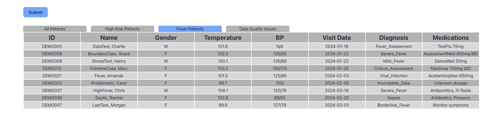

# Ksense Take Home



## Setup

1. Create a .env file and set the VITE_API_KEY to a valid API key.

2. Install the required dependencies with
```npm i```

3. Run the dev server with
```npm run dev```


## Tests

To execute the tests, run
```npx jest```